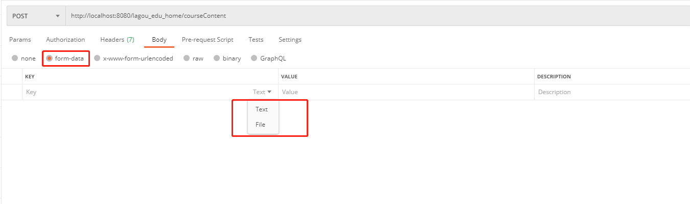

# 1. 常用的Maven命令

构建一个Maven工程项目，整个流程为：

- mvn clean   将target目录下的文件进行清除
- mvn compile 对工程进行编译，生成target目录
- mvn test    在target目录下生成surefire、surefire-reports（测试报告）、test-classes（测试的字节码文件）三个文件夹
- mvn package 打包操作，在target目录下生成jar或者war包(在pom文件中使用<packaging>war</packaging>进行打包成什么样的格式)
- mvn install 将打包好的jar包安装到本地Maven仓库，方便其他工程引用

# 2. Maven依赖的范围介绍

A依赖B，需要在 A 的 pom.xml 文件中添加 B 的坐标，添加坐标时需要指定依赖范围，依赖范围包括：

| 依赖范围 | 说明                                                         |
| -------- | ------------------------------------------------------------ |
| compile  | 编译范围，指 A在编译时依赖 B，此范围为默认依赖范围。编译范围的依赖会用在 编译、测试、运行，由于运行时需要所以编译范围的依赖会被打包。 |
| provided | provided 依赖只有在当 JDK 或者一个容器已提供该依赖之后才使用， provided 依 赖在编译和测试时需要，在运行时不需要，比如：servlet api 被 tomcat 容器提供。 |
| runtime  | runtime 依赖在运行和测试系统的时候需要，但在编译的时候不需要。比如：jdbc 的驱动包。由于运行时需要所以 runtime 范围的依赖会被打包。 |
| test     | test 范围依赖 在编译和运行时都不需要，它们只有在测试编译和测试运行阶段可用， 比如：junit。由于运行时不需要所以test范围依赖不会被打包。 |
| system   | system 范围依赖与 provided 类似，但是你必须显式的提供一个对于本地系统中 JAR 文件的路径，需要指定 systemPath 磁盘路径，system依赖不推荐使用。 |

# 3. Post请求的方式

## 3.1 multipart/form-data

多部件传输方式，也就是说选择这种方式进行上传，可以上传文件和参数

使用Postman工具进行该方式提交数据，如下图所示



这里的file就对应了你需要上传的图片、或者其他文件；Text类型就是普通key-value参数和参数值，下面使用Java进行实现一下文件上传

### 3.1.1 实现文件上传

- 加入依赖包

```xml
<dependencies>
        <!--  文件上传 -->
        <dependency>
            <groupId>commons-io</groupId>
            <artifactId>commons-io</artifactId>
            <version>1.4</version>
        </dependency>

        <dependency>
            <groupId>commons-fileupload</groupId>
            <artifactId>commons-fileupload</artifactId>
            <version>1.2.1</version>
        </dependency>
</dependencies>    
```

- 编写Java类

```java
public void getFileFromHttpRequest(HttpServletRequest request, HttpServletResponse response) throws ServletException, IOException {
        try {
            // 1. 创建磁盘文件工厂对象
            DiskFileItemFactory diskFileItemFactory = new DiskFileItemFactory();
            // 2. 创建文件上传核心类
            ServletFileUpload servletFileUpload = new ServletFileUpload(diskFileItemFactory);
            // 2.1 设置上传文件的编码
            servletFileUpload.setHeaderEncoding("UTF-8");
            // 2.2 判断表单是否是文件上传表单
            if (servletFileUpload.isMultipartContent(request)) {           // 是多部文件上传表单
                // 3. 解析request -> 获取表单项的集合
                List<FileItem> list = servletFileUpload.parseRequest(request);
                if (null != list) {
                    // 4. 遍历集合获取表单项
                    for (FileItem fileItem : list) {
                        // 5. 判断当前表单项 是不是普通表单项
                        if (fileItem.isFormField()) {                      // 普通表单项
                            String fieldName = fileItem.getFieldName();
                            // 设置编码
                            String fieldValue = null;//设置编码
                            try {
                                fieldValue = fileItem.getString("utf-8");
                            } catch (UnsupportedEncodingException e) {
                                e.printStackTrace();
                            }
                            System.out.println(fieldName +" = " +fieldValue);
                        } else {
                            //文件上传项
                            //获取文件名
                            String fileName = fileItem.getName();

                            // 拼接新的文件名，使用UUID保证唯一性
                            String newFileName = String.format("%s_%s", UUIDUtils.getUUID(), fileName);

                            // 获取输入流
                            InputStream inputStream = fileItem.getInputStream();

                            //创建输出流
                            //1.获取项目的运行目录 J:\install\apache-tomcat-9.0.41\webapps\lagou_edu_home\
                            String realPath = this.getServletContext().getRealPath("/");

                            //2.截取到 webapps目录路径
                            String wabappsPath = realPath.substring(0, realPath.indexOf("lagou_edu_home"));

                            //3.拼接输出路径,将图片保存到 upload
                            FileOutputStream out = new FileOutputStream(wabappsPath+"/upload/" + newFileName);

                            //使用IOUtils完成 文件的copy
                            IOUtils.copy(inputStream,out);

                            //关闭流
                            out.close();
                            inputStream.close();
                        }
                    }

                }
            }
        } catch (FileUploadException  e) {
            e.printStackTrace();
        }
    }
```


## 3.2 application/x-www-form-urlencoded

提交form表单，只能是key-value值

- Java获取form表单里面的参数值

```java
protected void doPost(HttpServletRequest request, HttpServletResponse response) throws ServletException, IOException {
        // 1. 获取post请求中from表单的数据
        Map<String, String[]> parameterMap = request.getParameterMap();
        parameterMap.entrySet().forEach(System.out::print);
    }
```

## 3.3 raw

提交Json数据格式，在Servlet中使用工具类进行解析获取参数值

- Java获取Json数据格式的参数值

```java
public String getPostJSON(HttpServletRequest request){

        try {
            //1.从request中 获取缓冲输入流对象
            BufferedReader reader = request.getReader();

            //2.创建StringBuffer 保存读取出的数据
            StringBuffer sb = new StringBuffer();

            //3.循环读取
            String line = null;
            while((line = reader.readLine()) != null){
                //将每次读取的数据 追加到StringBuffer
                sb.append(line);
            }

            //4.返回结果
            return sb.toString();
        } catch (IOException e) {
            e.printStackTrace();
            return null;
        }
    }
```

总结：读取请求里面的流，然后转为Map结构

# 4. JSON

Json（JavaScript Object Notation）一种轻量级别的数据交换格式，采用完全独立于语言的文本格式（就是说不用编程语言的JSON数据是一样的），同时易于人阅读和编写，同时也易于机器解析和生成。

## 4.1 XML与JSON

- XML是一种可扩展标记语言，用来标记电子文件使其具有结构性的标记语言

- JSON是一种轻量级的数据交换格式

- 共同点

```text
都作为一种数据交换格式
```

- 不同点

```text
1. XML是重量级的，JSON是轻量级的,XML在传输过程中比较占带宽，JSON占带宽少，易于压缩。
2. XML和json都用在项目交互下，XML多用于做配置文件，JSON用于数据交互
3. JSON独立于编程语言存在,任何编程语言都可以去解析json
```

## 4.2 常用Java对象和JSON格式转换工具类

### 4.2.1 FastJson

- 阿里开发的一个Java类库，实现Java与Json两者之间相互转化

- 特点

```text
1. 支持Java Bean序列化成JSON串，JSON串反序列化成Java Bean
2. 速度快
3. 无其他包依赖
```

- 常用注解

```java
public class Person {
	
    /**
     * @JSONField 注解
     * 指定name属性, 字段的名称
     * 使用 ordinal属性, 指定字段的顺序
     * 使用 serialize属性, 指定字段不序列化
     **/
    @JSONField(name="USERNAME",ordinal = 1)
    private String username;

    @JSONField(name="AGE",ordinal = 2)
    private int age;

    //排除不需要序列化的字段
    @JSONField(serialize = false)
    private String birthday;

    public Person() {
    }

    public Person(String username, int age, String birthday) {
        this.username = username;
        this.age = age;
        this.birthday = birthday;
    }
}
```

- 常用方法

```java
public class Test {
       
    /**
     * JSON.parseObject() 将 JSON 字符串转换为 Java 对象
     * JSON.parseArray() 将 JSON 字符串转换为 集合对象
     **/
      public void JSONToJavaBean(){

        String json = "{\"age\":15,\"birthday\":\"2020-07-03 19:54:33\",\"username\":\"码云\"}";
        Person person = JSON.parseObject(json, Person.class);
        System.out.println(person);

        //创建Person对象
        String json2 ="[{\"age\":15,\"birthday\":\"2020-07-03 19:59:05\",\"username\":\"码云\"},{\"age\":13,\"birthday\":\"2020-07-03 19:59:05\",\"username\":\"虎子\"},{\"age\":18,\"birthday\":\"2020-07-03 19:59:05\",\"username\":\"小斌\"}]";
        List<Person> list  = JSON.parseArray(json2,Person.class);
        System.out.println(list);
    }
}
    
```
